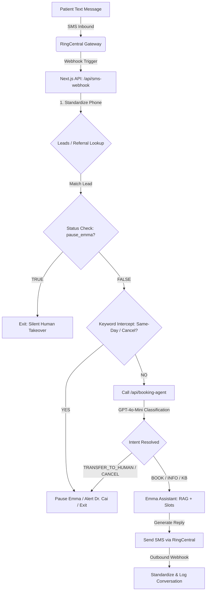

# 📊 AcuTherapy AI Booking System (Emma) System Documentation (v5.15)

This document provides a comprehensive technical overview, database schema guide, and architectural summary of the AI Booking System (Emma) developed for AcuTherapy Clinics. It serves as the master guide for maintaining, troubleshooting, and further optimizing the system.

---

## 🗺️ 1. System Architecture & Technical Design

The system is built as a serverless application utilizing a modern, decoupled stack to ensure real-time responsiveness, safety-first human takeover, and automated operational reporting.

### Key Technologies
* **Core Application**: Next.js (App Router, TypeScript) deployed on Vercel.
* **Database & Storage**: Supabase (PostgreSQL) for real-time leads, referrals, and conversation logging.
* **Communication Gateway**: RingCentral SDK for programmatic SMS outreach, inbound message webhook interception, and manual staff override monitoring.
* **Artificial Intelligence**: OpenAI API (`gpt-4o-mini`) for intent classification, clinical Knowledge Base RAG matching, and conversational scheduling (Emma).
* **Calendar Sync**: Google Calendar API (`googleapis` v3) for checking capacity and slot availability on the main Clinic JaneApp feed and the AI Calendar.

---

## 📦 2. Core Functional Modules

### 2.1. RAG Knowledge Base & Dynamic Booking
* **Clinical RAG**: Matches patient complaints against official clinic condition pages. It enforces exact matching (preventing false positives) and appends official page links (e.g., sciatica, auto accidents) to build trust.
* **Dynamic Slots**: Queries Google Calendar in real-time, enforcing seat capacity safety guidelines (Acupuncture: 2 simultaneous seats, Massage: 1 seat) to suggest valid booking slots.

### 2.2. Human Takeover & Urgent Interception (SLA Guard)
* **Keyword Interception**: Automatically intercepts same-day requests (e.g., `today`, `same day`, `今天`) and ignores cancellation terms to prevent false alarms.
* **Early Intent Takeover**: If the booking agent classifies the message as `TRANSFER_TO_HUMAN`, `CANCEL_APPOINTMENT`, or `UNKNOWN`, Emma immediately:
  1. Sets `pause_emma = true` and `pending_human_reply = true`.
  2. Sends an urgent SMS alert to the doctor with the patient's name and message details.
  3. Exits early **without** sending an automated reply, leaving the patient in a silent queue for human follow-up.
* **Manual Override**: If a staff member sends any outbound SMS via RingCentral, the system automatically marks the lead as `pause_emma = true` and resets `pending_human_reply = false`.

### 2.3. Automated Follow-up Campaigns (Follow-up Cron)
* **Timeline**: Triggers automated check-ins via `/api/cron/follow-up` based on elapsed days:
  * Stage 1: 1 day (24 hours) after lead creation.
  * Stage 2: 3 days after lead creation.
  * Stage 3: 5 days after lead creation.
  * Stage 4: 7 days after lead creation.
  * Stage 5: 14 days after lead creation.
* **Safety Guards**: Automatically bypasses leads who are in human-takeover mode (`pause_emma = true`) or where the last message in the thread was sent by the user (preventing automated messages from interrupting active conversations).

### 2.4. Patient Referrals Synchronization (VA Referrals)
* **Reconciliation Engine**: Calculates remaining visits in real-time by subtracting the number of booked appointments on the Google Calendar from the `total_authorized_visits` in the database.
* **Proactive Alerts**: Triggers warnings to staff when remaining visits run low (1 or 2 left) or when the referral is within 14 days of expiration, allowing Emma to prompt the patient to schedule their remaining care.

### 2.5. Daily Executive Report
* **Daily Cron**: Deployed at `/api/cron/daily-report` (runs every morning at 8:00 AM HST).
* **Live Calendar Auditing**: Directly queries Google Calendar (Clinic & AI feeds) to count today's actual patient schedule (filtering out break blocks, lunch, and vacations) and reports Acupuncture vs. Massage counts.
* **SLA Warnings**: Highlights any unanswered same-day requests from the previous day (leads with `pending_human_reply = true`) to ensure no patient is left without a response.
* **Self-Learning upgrade**: Logs unmatched user questions from the previous day and suggests precise QA Q&A database insertion prompts for continuous learning.

---

## 🗄️ 3. Database Schema Guide

The database is hosted on Supabase (PostgreSQL). All tables are standardized to use E.164 phone formatting (`+1XXXXXXXXXX`) to ensure seamless key constraints and message matching.

### 3.1. `leads` Table (Patient Lead Registry)
Stores prospective patient contact details, insurance context, and AI override statuses.

| Column | Type | Default | Description |
| :--- | :--- | :--- | :--- |
| `id` | `UUID` | `gen_random_uuid()` | Primary Key |
| `created_at` | `TIMESTAMPTZ` | `now()` | Timestamp of lead insertion |
| `name` | `TEXT` | - | Patient full name |
| `phone` | `TEXT` | - | Patient phone number (standardized E.164) |
| `email` | `TEXT` | `NULL` | Patient email address |
| `condition` | `TEXT` | `NULL` | Patient's chief complaint / symptoms |
| `status` | `TEXT` | `"NEW"` | Lead status (`NEW`, `CONTACTED`, `BOOKED`) |
| `source` | `TEXT` | `"WEBSITE"` | Creation source (`WEBSITE`, `SMS`) |
| `pause_emma` | `BOOLEAN` | `false` | If `true`, Emma is silent and human has taken over |
| `pending_human_reply` | `BOOLEAN` | `false` | If `true`, patient is in the urgent SLA queue |
| `same_day_requested_at`| `TIMESTAMPTZ`| `NULL` | Timestamp of last same-day request |
| `follow_up_stage` | `INT` | `0` | Stage index of current follow-up campaign |
| `notes` | `TEXT` | `NULL` | Operational notes and system logs |

### 3.2. `patient_referrals` Table (Insurance / VA Referral Tracking)
Tracks authorized visit balances and expiration dates.

| Column | Type | Default | Description |
| :--- | :--- | :--- | :--- |
| `id` | `UUID` | `gen_random_uuid()` | Primary Key |
| `created_at` | `TIMESTAMPTZ` | `now()` | Date referral was created |
| `phone` | `TEXT` | - | Patient phone (standardized E.164) |
| `patient_name` | `TEXT` | - | Patient full name |
| `referral_number` | `TEXT` | - | Authorization number / Referral ID |
| `service_type` | `TEXT` | `"Acupuncture"` | Type of therapy (`Acupuncture`, `Massage`) |
| `total_authorized_visits`| `INT` | `0` | Total visits approved in referral |
| `used_visits` | `INT` | `0` | Real-time synced count of visits completed |
| `remaining_visits` | `INT` | `0` | Calculated remaining balance (`total - used`) |
| `referral_end_date` | `DATE` | - | Authorization expiration date |
| `referral_status` | `TEXT` | `"Active"` | Status (`Active`, `Expired`, `FullyUsed`) |

### 3.3. `sms_conversations` Table (SMS Dialogue History)
Used to feed Emma's context window and audit conversations.

| Column | Type | Default | Description |
| :--- | :--- | :--- | :--- |
| `id` | `BIGINT` | Identity | Primary Key |
| `created_at` | `TIMESTAMPTZ` | `now()` | Time message was processed |
| `phone` | `TEXT` | - | Standardized E.164 phone number of patient |
| `role` | `TEXT` | - | Sender role (`user` or `assistant`) |
| `message` | `TEXT` | - | Body of the SMS |

### 3.4. `clinic_kb` Table (Knowledge Base RAG)
Houses the clinic facts and policy details.

| Column | Type | Default | Description |
| :--- | :--- | :--- | :--- |
| `id` | `BIGINT` | Identity | Primary Key |
| `keyword` | `TEXT` | - | Trigger term / clinical symptom (e.g. `sciatica`, `hmsa`) |
| `answer` | `TEXT` | - | Verified clinic policy response / facts |
| `url` | `TEXT` | `NULL` | Condition details page URL for booking steering |

---

## 🛠️ 4. Finalized & Well-Performing Implementations

1. **E.164 Phone Formatting**: Every communication layer (web form, SMS webhook, database logs) cleans and prefixes numbers to `+1XXXXXXXXXX`, completely resolving historic sync and duplication issues.
2. **Immediate Human Takeover Routing**: Webhook intercepts cancellations and complex questions, alerting the doctor instantly via high-priority SMS while putting Emma in silent mode.
3. **No Proactive Cancellation Proposals**: Emma's prompt strictly forbids her from offering to cancel/reschedule appointments unless explicitly requested by the patient.
4. **Live Calendar Auditing**: Reports and calculations rely on direct, real-time Google Calendar reads rather than database records, resulting in 100% accurate daily counts.
5. **Low-Balance VA Referral Warnings**: Automatically calculates remaining authorized sessions and triggers early scheduling calls to ensure patient retention.

---

## 🚀 5. Roadmap & Areas for Future Optimization

### 5.1. JaneApp API Direct Integration
* **Current State**: System reads JaneApp appointments indirectly via a read-only Google Calendar import feed.
* **Optimization**: Transition to direct JaneApp API endpoints (if supported) to automatically check in patients, update charts, and sync cancellations programmatically.

### 5.2. Webhook Concurrency & Queueing
* **Current State**: Serverless functions process RingCentral webhooks concurrently. High-frequency duplicate calls from RingCentral might cause concurrent execution issues.
* **Optimization**: Implement a lightweight message broker (e.g., Upstash Redis Queue) to serialize incoming SMS webhook events, ensuring message order is preserved and duplicates are safely ignored.

### 5.3. Structured OpenAI Outputs
* **Current State**: Intent classification parses text using string replacements.
* **Optimization**: Update `/api/booking-agent` to use OpenAI's **Structured Outputs (JSON Schema)** to guarantee 100% parseable classifications and further decrease token usage.

### 5.4. Contextual Multi-lingual Conversational Quality
* **Current State**: Emma supports monolingual responses in English, Chinese, Japanese, Korean, and Spanish.
* **Optimization**: Refine the prompt to prevent literal translations of medical slang and ensure warm, localized phrasing in Chinese and Japanese.
